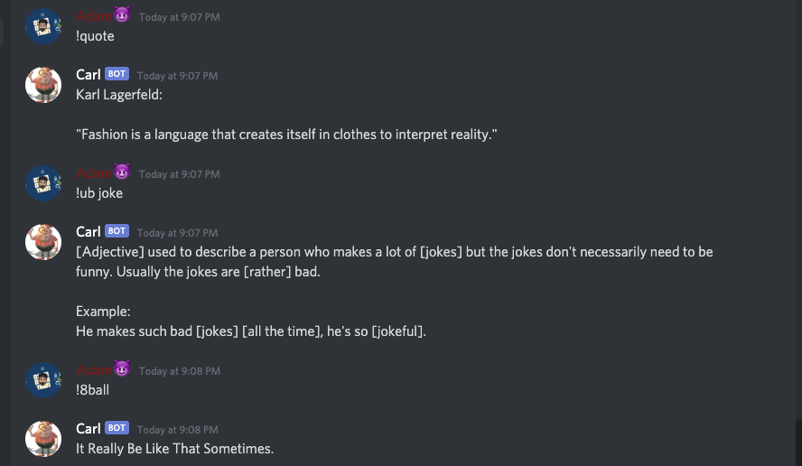

# Discord Chat Bot
A  chat bot to assist your discord server.

## How It Works
- The Stack used here is Node.js, along with Discord.js, and various APIs.

- The bot can fetch urban dictionary definitions, tell jokes, send memes, tell random quotes, among other commands.

## How To Use

- Clone this repository

- You'll first have to create a discord bot application https://discordapp.com/developers/applications

- Once that is configured, you will need a Rapid API Key for a new of the commands

- I might host the bot one day so you may just invite it to your server, but for now this will get you up and running on running it locally (Docs: https://discordjs.guide/)

## Examples

